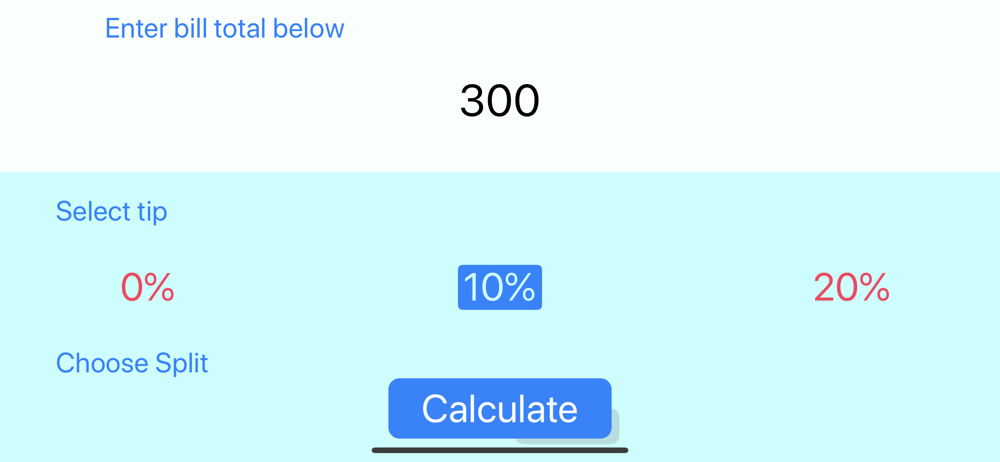

# Bill-Tip-Split
Bill-Tip splitting app. This app will do the math for you and calculate the amount to be paid by the number of persons given bill total and tips. This app was build following Angela's course on Udemy with some amendments.

<table>
 <tr>
    <td> • GIF </td>
    <td> • Landscape Shot </td>
  </tr> 
  <tr>
    <td> </td>
    <td></td>
  </td>
  </tr>
